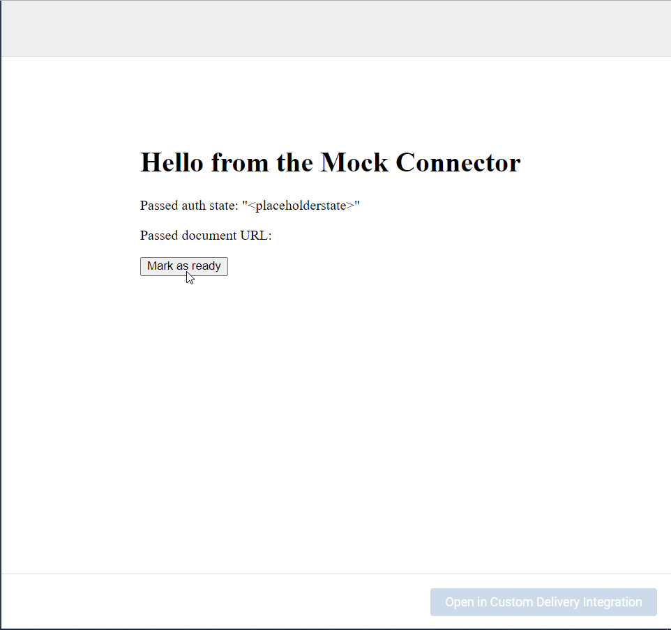

# Flow
This page describes the interaction between the Generic Delivery Connector, Templafy and the user.

### Initialize
* The user clicks the Generic Delivery Connector.


An iframe will be rendered in the background pointing towards the `Base URL` specified in the settings.
This URL should host the Delivery Controller.
The Controller first needs to be initialized using:

**React:**
``` ts
useInitialize();
```

**TypeScript:**
``` ts
Templafy.initialize();
```

### Check authentication needed
* The controller should then let Templafy know whether to show an authentication popup using:

**React:**
``` ts
const {setAuthenticationNeeded} = useInitialize();
setAuthenticationNeeded({shouldAuthenticate, authenticationUrl});
```

**TypeScript:**
``` ts
await Templafy.initialize({shouldAuthenticate, authenticationUrl});
```

### Report authentication result from popup
* The popup can then report the result of the authentication using:

**React:** `sendAuthenticationComplete({authenticationSuccessful, state: "<some state>"});`

**TypeScript:** `Templafy.sendAuthenticationComplete({authenticationSuccessful, state: "<some state>"});`


There is a possibility to pass some arbitrary state to the Delivery Controller.
This will be available from:

**React:**
``` ts
const {authenticationState} = useInitialize();
```

**TypeScript:**
``` ts
const {authenticationState} = await Templafy.initialize();
```

* Once the user clicks the Open/Share/Save button, the Delivery Controller will be shown.


### Requesting input
* The Delivery Controller can now ask for user input.
Once all required input is gathered, the Delivery Controller can report that it's ready to upload using:

**React:**
``` ts
const {sendCanUpload} = useOptions();
sendCanUpload(canupload: true);
```

**TypeScript:**
``` ts
Templafy.sendCanUpload({canUpload: true});
```




### Handling created document
* At this point, a loading screen will be shown and the Delivery Controller will be sent a download URL pointing to the created document.
It can be retrieved using:

**React:**
``` ts
const {documentLink} = useDocumentLink();
```

**TypeScript:**
``` ts
const documentUrl = await Templafy.getDocumentUrl();
```

### Redirecting the user
After the Delivery Controller has completed the upload, it can redirect the main window to
the location of the document using:

**React:**
``` ts
const {uploadComplete} = useDocumentLink();
uploadComplete("https://LOCATION_OF_DOCUMENT");
```

**TypeScript:**
``` ts
Templafy.uploadComplete("https://LOCATION_OF_DOCUMENT");
```
