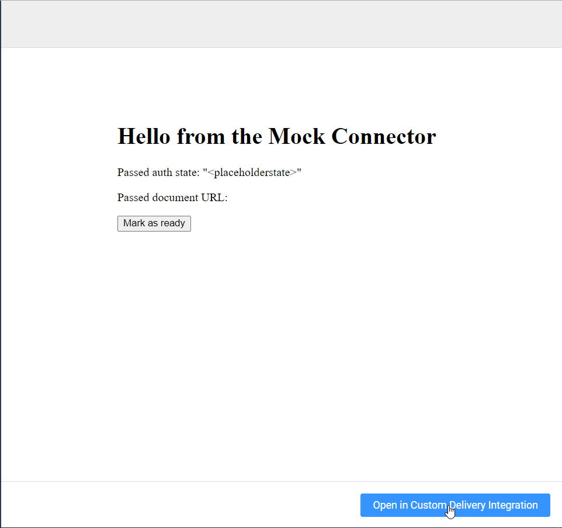

# Flow
This page describes the interaction between the Generic Delivery Connector, Templafy and the user.

## Initialize
* The user clicks the Generic Delivery Connector.


An iframe will be rendered in the background pointing towards the `Base URL` specified in the settings.
This URL should host the Delivery Controller.
The Controller first needs to be initialized using:

**React:**
``` ts
useInitialize();
```

**TypeScript:**
``` ts
await Templafy.initialize();
```

## Requesting input

* The Delivery Controller can specify the next action of the button by invoking on of the following methods:

`Templafy.sendRequireInput()` *Next click shows Delivery Controller content*

`Templafy.sendShouldAuthenticate()` *Next click opens authentication popup*

`Templafy.sendCanUpload()` *Next click sends the document URL to the Delivery Controller and shows finalization screen*

`Templafy.sendClearButton()` *Next click clears the next action, disabling the button*





## Check authentication needed
* The controller should then let Templafy know whether to show an authentication popup using:

``` ts
Templafy.sendShouldAuthenticate({
    shouldAuthenticate: true | false;
    authenticationUrl?: "location of authentication popup";
})
```

## Report authentication result from popup
* The popup can then report the result of the authentication using:

``` ts
Templafy.sendAuthenticationComplete({
    authenticationSuccessful: true,
    state: "<some state>"
});
```


There is a possibility to pass some arbitrary state to the Delivery Controller.
This will be available from:

**React:**
``` ts
const {authenticationState} = useInitialize();
```

**TypeScript:**
``` ts
const {
    authenticationState,
    authenticationSuccessful
    } = await Templafy.getAuthenticationState();
```

## Handling created document
* At this point, a loading screen will be shown and the Delivery Controller will be sent a download URL pointing to the created document.
It can be retrieved using:

**React:**
``` ts
const {documentUrl} = useDocumentUrl();
```

**TypeScript:**
``` ts
const documentUrl = await Templafy.getDocumentUrl();
```

## Redirecting the user
After the Delivery Controller has completed the upload, it can redirect the main window to
the location of the document using:

``` ts
Templafy.sendUploadComplete("https://LOCATION_OF_DOCUMENT");
```
